# Sneakerheads

## Description

Sneakerheads is an online forum for shoe collectors to share their collections or to buy/trade shoes from other collectors. Additionally, users are able to chat with their fellow Sneakerheads in the app. A feed page shows all uploads from other users. If you'd like to review a certain user's page, you can click on their name from the feed page. 

## Built with: 
Express, React JS, Node JS, Material UI, React Chat App, React-Bootstrap, MySQL (via MySQL Workbench), JAWSDB, JSON Webtoken
  
## Installation
### View the Project Live <br>
https://sneaker-heads.herokuapp.com/

### Run the Project Locally

* Step 1: Navigate to the directory you want to store the project. Clone this your repository to your local computer using the command below. 
```bash
git clone https://github.com/hugo2211/Sneaker_Head
```

* Step 2: Use the command line to navigate to the directory that you cloned the project.
Example:
```bash
cd directory/projectdirectory
```

* Step 3: Install the npm package dependencies from the package.json file.
```bash
npm install
```

* Step 4: While in the project directory, run the program using node using the command below. Open you browser and navigate to localhost:3000 to view the application.
```bash
npm start
```  
## Usage 

### Login Page

The application brings up the login page. If an account already exists, the user may enter their email and password associated with the account.  

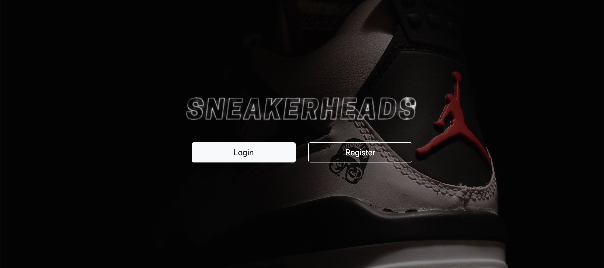

If not, the user must select Register, which takes them to the Registration page. 

### Register Page

The registration page will ask for a first and last name, email, and a password. 

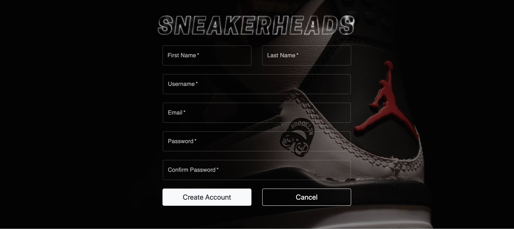

Once this information has been entered, the application will push the user back to the login page to use their new credentials. 

### Profile Page

Once appropriate credentials have been entered, the user is taken to the profile page. This page shows all of the user's personal shoe collection. 

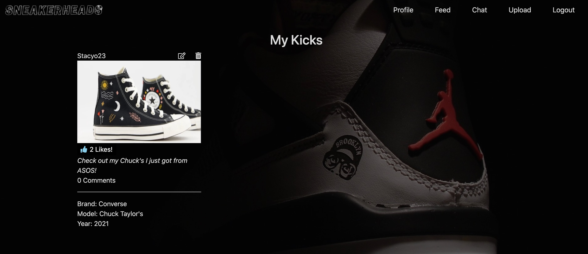

From this page, the user has the ability to edit their post. 

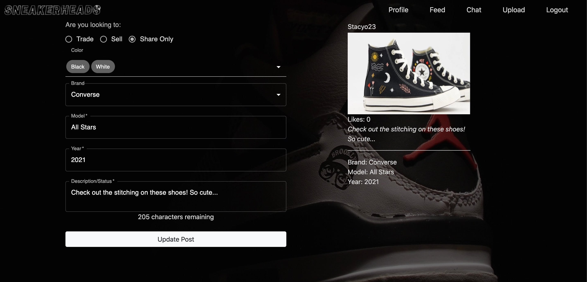

As well, the user has the ability to delete their post. A modal will popup to ensure that the user is intentionally deleting their post.

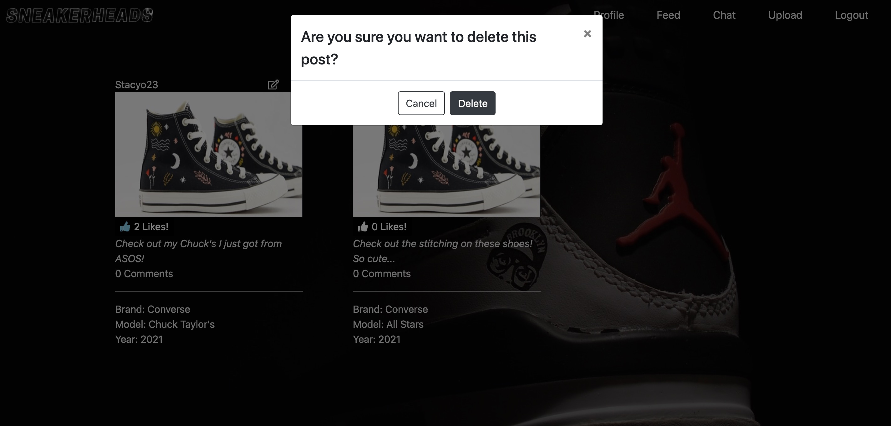


### Feed Page

The feed page contains content from other users. The user is able to browse the entire feed. 


Should the user wish to browse a certain collection, they can click on the name of a user and be taken to that user's collection. 

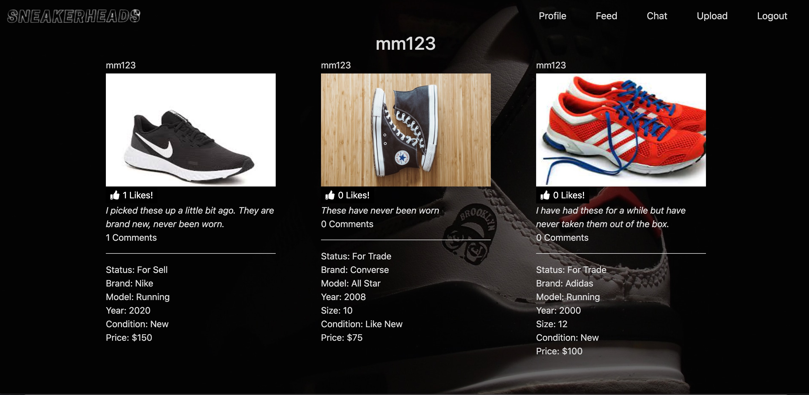

As well, if the user is searching for a certain brand or style, they may use the search feature to find what they're looking for.

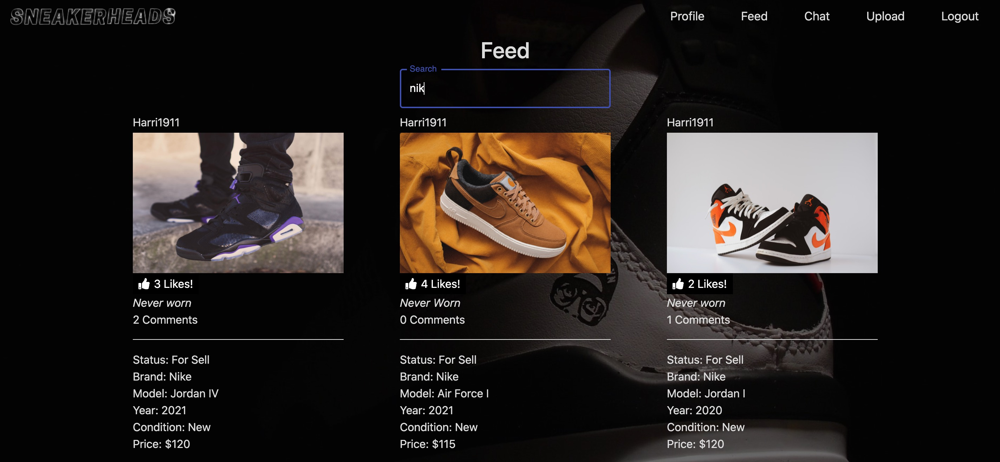


### Chat Page

The chat feature allows users to converse about their collections as well as make an offer on a pair of shoes they like. 

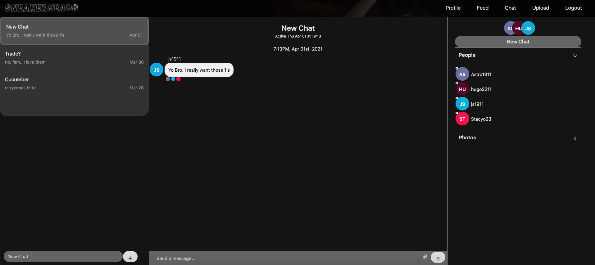

Simply select the plus next to new chat.


Select the user to initiate the conversation.

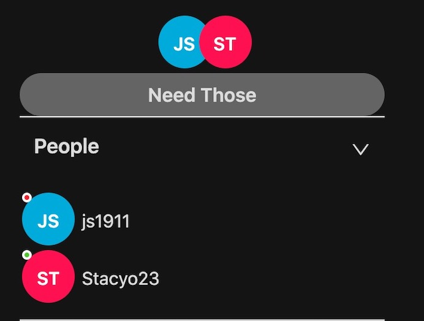

Type a message in the chat

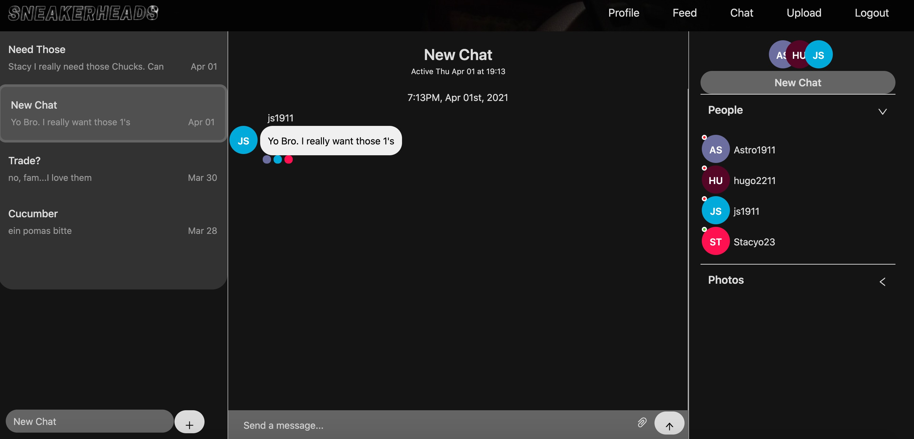

The other user is also able to respond.

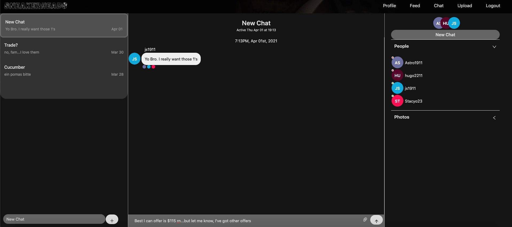
<br>

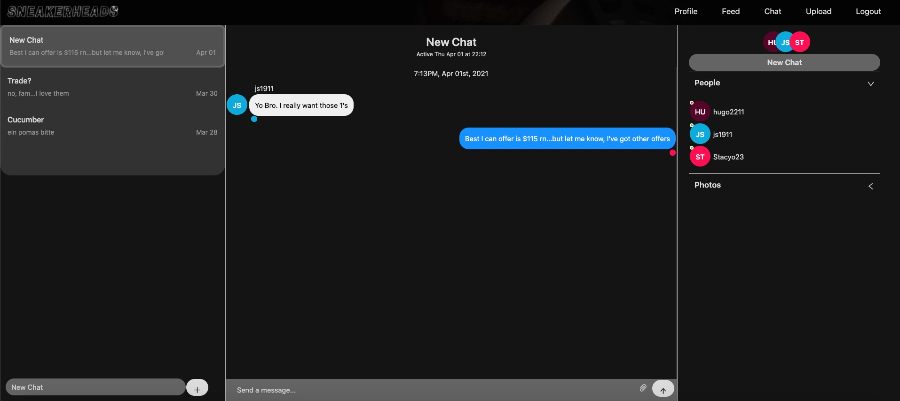


### Upload Page

The upload page provides the user with the ability to upload shoes from their own collection, including photos of the shoes. 

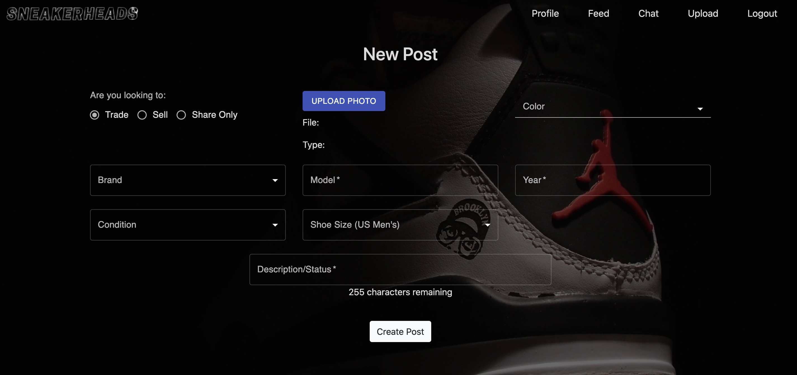

Below is an example of a user entering a new shoe into their 

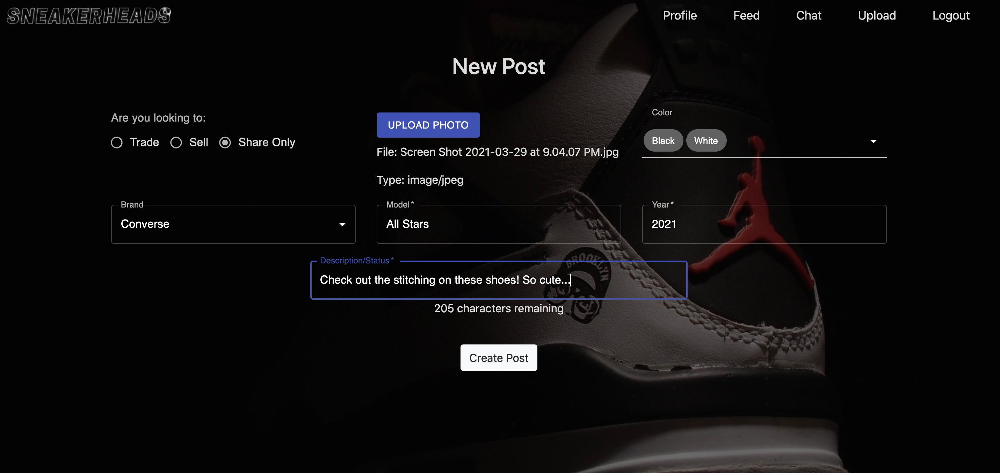

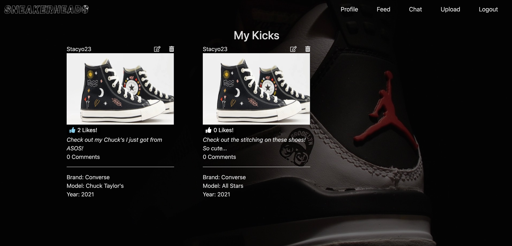

### Questions
Feel free to reach out to any of us if you have any questions/feedback about this project:  
[Stacy Betts](https://github.com/stacyo23), [Jeffrey Davis](https://github.com/kingdonut23), [Harrison Glover](https://github.com/Glove1911), [Victor Mendizabal](https://github.com/hugo2211), [Mark Mulligan](https://github.com/Mark-Mulligan)

## License
MIT License

### Repository
[Repository](https://github.com/hugo2211/Sneaker_Head)

### Heroku
[Heroku](http://sneaker-heads.herokuapp.com/)